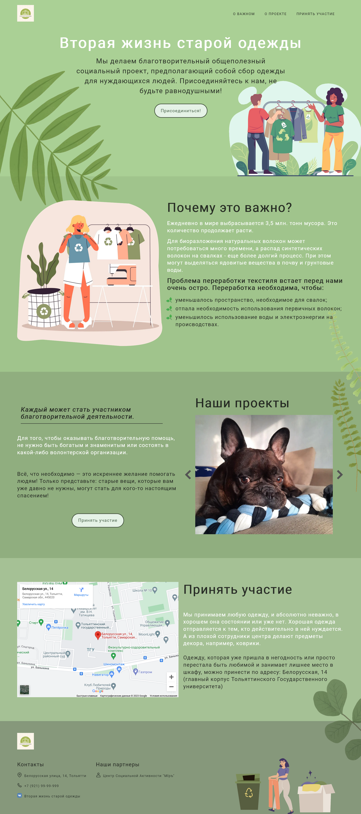

# Online shop landing page

This is a pet project using flexbox, grid and jquery.

## Table of contents

- [Overview](#overview)
  - [Screenshot](#screenshot)
  - [Links](#links)
- [My process](#my-process)
  - [Built with](#built-with)
- [Author](#author)

## Overview

### Screenshot

### Links

- Live Site URL: (https://tatyanatropkina.github.io/Second-life/)

## My process

### Built with

- Semantic HTML5 markup
- Bem methodology
- CSS custom properties
- Flexbox
- CSS Grid
- [Jquery](https://jquery.com/) - JS library
- [Slick slider](https://kenwheeler.github.io/slick/) - JS plugin

### Continued development

## Author

- GitHub - [@TatyanaTropkina](https://github.com/TatyanaTropkina)
